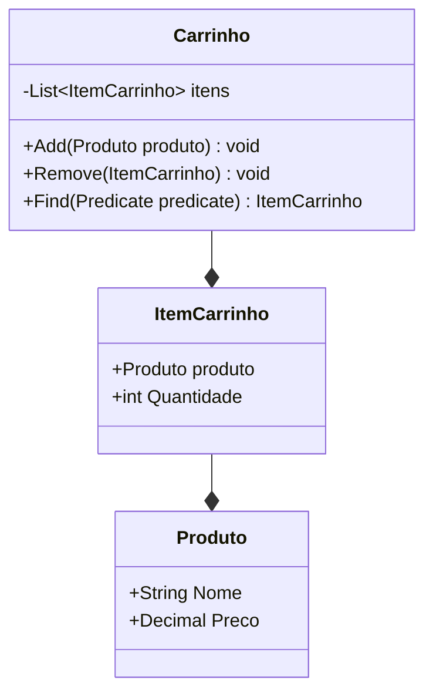
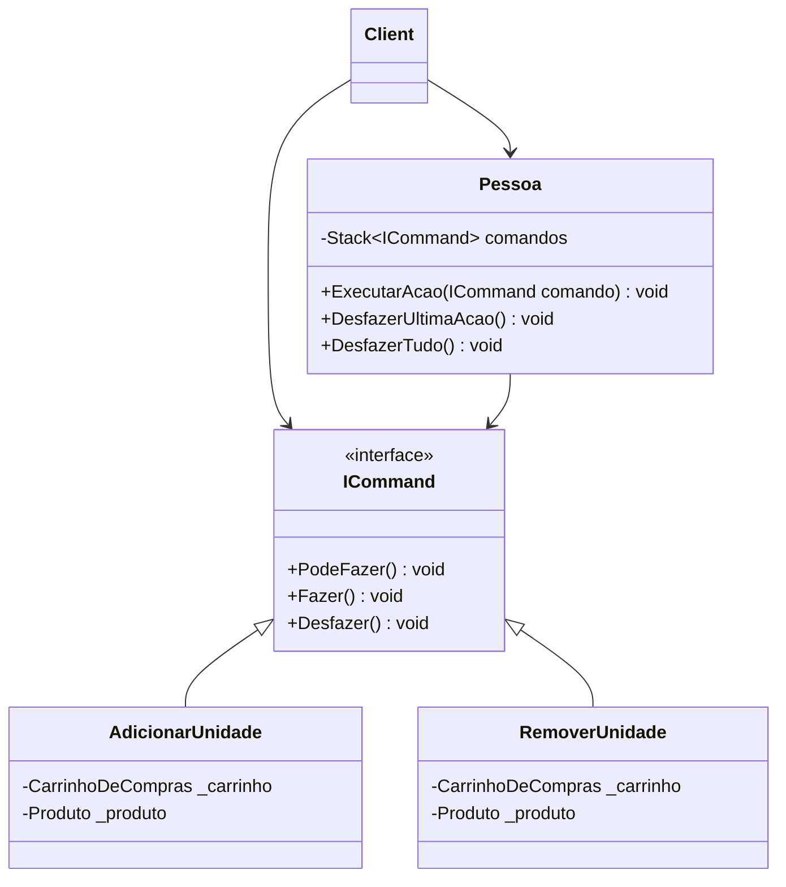

# Design Pattern Command

## Problema Proposto
O modelo de problema proposto é de uma simulação de uma pessoa comprando frutas.

Pense que temos uma pessoa em um supermercado e essa pessoa deseja poder adicionar e remover itens do seu carrinho, ela tambem deseja que assim que ela colocar ou remover algo do carrinho ela possa desfazer essa ação respeitando a ordem que das ações tomadas, ou seja, se ela adiciona um morango no carrinho e depois adiciona uma banana quando ela for desfazer a utilma ação ela devera retirar a banana e não o morango.

## Reflexão
Preciso que você pense em formas de resolver esse problema respeitando os principios SOLID.



### Solução Ruim
Bom eu penso que nesse problema não existe uma solução ruim, ele é bem claro e diz que você vai precisar armazenar os comandos que foram executados respeitando uma ordem, outra dica é que você precisa guardar comandos, ou seja, voce precisa de uma coleção com um tipo que englobe todo e qualquer comando relacionado ao carrinho deixando clara a necessidade de usar herança ou interfaces.

### Solução Mediana
Como não temos solução ruim eu vou fazer uma mediana utilizando delegates, olha eu realmente acho que essa solução não é boa e vou dar os motivos, antes vou criar o código que vai se basear em funções,
cada comando sera representado por uma função que vai "herdar" de um delegate especifico que vamos criar também, além disso eu mensionei que usariamos uma coleção para armazenar os comando e se você pensou em listas ou filas chegou perto, mas queremos utilizar uma pilha para esse problema onde cada comando executado vai para o topo da pilha e dessa forma sempre vamos retirar o ultimo comando executado para desfaze-lo.
```csharp
namespace Principal
{
    public class Program
    {
        public static Action<CarrinhoDeCompras, Produto> adicionaUnidade = 
            (carrinho, produto) =>
                {
                    if (produto is null || carrinho is null) return;
                    var item = carrinho.Find(p => p.Nome == produto.Nome);

                    if (item is null) carrinho.Add(produto);
                    else item.Quantidade++;
                };

        public static Action<CarrinhoDeCompras, Produto> removeUnidade = 
            (carrinho, produto) =>
                {
                    if (produto is null || carrinho is null) return;
                    var item = carrinho.Find(p => p.Nome == produto.Nome);

                    if (item?.Quantidade > 1) item.Quantidade--;
                    else if (item is not null) carrinho.Remove(item);
                };
        
        public class Comando
        {
            private Action<CarrinhoDeCompras, Produto> _acao;
            private CarrinhoDeCompras _carrinhoDeCompras;
            private Produto _produto;

            public Comando(
                Action<CarrinhoDeCompras, Produto> acao,
                CarrinhoDeCompras carrinho,
                Produto produto
            )
            {
                _acao = acao;
                _carrinhoDeCompras = carrinho;
                _produto = produto;
            }

            public void Executar() => _acao.Invoke(_carrinhoDeCompras, _produto);
        }


        public class Pessoa
        {
            private Stack<Comando> comandos = new Stack<Comando>();
            public void ExecutarAcao(Comando fazer, Comando desfazer)
            {
                fazer.Executar();
                comandos.Push(desfazer);
            }

            public void DesfazerUltimaAcao()
            {
                if (comandos.Count() != 0) comandos.Pop().Executar();
            }

            public void DesfazerTudo()
            {
                while (comandos.Count() != 0) comandos.Pop().Executar();
            }
        }

        public static void Main()
        {
            Produto abacaxi = new Produto("Abacaxi", 8m);
            CarrinhoDeCompras carrinho = new CarrinhoDeCompras();
            Pessoa pessoa = new Pessoa();
            Comando adicionarUnidadeProduto = new Comando(adicionaUnidade, carrinho, abacaxi);
            Comando removerUnidadeProduto = new Comando(removeUnidade, carrinho, abacaxi);

            Console.WriteLine($"Carrinho no Inicio.{carrinho}");

            pessoa.ExecutarAcao(adicionarUnidadeProduto, removerUnidadeProduto);
            Console.WriteLine($"Adicionando Abacaxi ao Carrinho com Action.{carrinho}");

            pessoa.ExecutarAcao(adicionarUnidadeProduto, removerUnidadeProduto);
            Console.WriteLine(
                $"Adicionando mais um Abacaxi ao Carrinho com Action.{carrinho}"
            );

            pessoa.ExecutarAcao(adicionarUnidadeProduto, removerUnidadeProduto);
            Console.WriteLine(
                $"Adicionando mais um Abacaxi ao Carrinho com Action.{carrinho}"
            );


            pessoa.DesfazerUltimaAcao();
            Console.Write("Removendo um Abacaxi do Carrinho, ");
            Console.ForegroundColor = ConsoleColor.Yellow;
            Console.Write($"usando desfazer do aicionarUnidadeProduto.\n");
            Console.ForegroundColor = ConsoleColor.White;
            Console.WriteLine(carrinho);

            pessoa.ExecutarAcao(removerUnidadeProduto, adicionarUnidadeProduto);
            Console.Write("Removendo um Abacaxi do Carrinho, ");
            Console.ForegroundColor = ConsoleColor.Yellow;
            Console.Write($"usando removerUnidadeProduto.\n");
            Console.ForegroundColor = ConsoleColor.White;
            Console.WriteLine(carrinho);

            pessoa.DesfazerUltimaAcao();
            Console.Write("Adicionando um Abacaxi do Carrinho, ");
            Console.ForegroundColor = ConsoleColor.Yellow;
            Console.Write($"usando desfazer do adicionarUnidadeProduto.\n");
            Console.ForegroundColor = ConsoleColor.White;
            Console.WriteLine(carrinho);

            pessoa.DesfazerTudo();
            Console.Write("Removendo todos os Abacaxis do Carrinho, ");
            Console.ForegroundColor = ConsoleColor.Yellow;
            Console.Write($"usando De'sfazerTudo.\n");
            Console.ForegroundColor = ConsoleColor.White;
            Console.WriteLine(carrinho);
        }
    }
}
```

A implementação acima funciona bem, entretanto temos um problema nela repare que quando chamamos o método __ExecutarAcao( )__ temos que passar a ação que queremos executar e a ação que desfaz oque queremos fazer, isso é ruim pois podemos errar na passagem de parametros e causar bugs ou até mesmo falhas graves na aplicação. Eu particularmente gostei de utilizar o delegate Action para escrever os comandos entretanto como eu disse o comando não sabe desfazer oque fez, temos formas melhores para resolver esse problema a primeira seria mudando a classe comando para na sua instanciação receber a ação responsavel por desfazer o comando, desssa forma resolvemos a questão da passagem de parametros para o método  __ExecutarAcao( )__ e fazemos com que o comando saiba desfazer o oque fez. Com as mudanças propostas temos basicamente a implementação do pattern Command, a solução mediana com as alterações propostas server muito bem para a maioria dos casos.

## Introdução ao Command e Aplicação
Vou apresentar primeiramente o diagrama UML do padrão, e relacionar com nosso problema.


Vamos olhar para interface ICommand, ele define os métodos que nossos comandos relacionados ao carrinho de compras cão ter, devemos verificar se podemos executar o comando, tambem devemos ter uma forma de executar o comando e defazer as ações do comando, ou seja, devemos ver se temos por exemplo estoque suficiente para executar o adicionar unidade e tambem se o produto existe no carrinho antes de tentar remover uma unidade do carrinho. 
Repare que oque fizemos na solução mediana foi utilizar os comandos como funções e na aplicação do pattern Command eles se tornaram classes, isso traz beneficios em relação a possibilidade injetar as dependencias na classe ao invés de passar como parametros nas funções de comando, o nivel de organização fica maior, entretanto voce deve pensar que também esta criando mais classes ao invés de funções mais simples.

Para concluir você também deve perceber que a classe __Client__ que é quem usa nosso código tem duas possibilidades, ela pode chamar os métodos de um comando diretamente ou pode fazer isso utilizando a classe __Pessoa__ isso depende do comportamento que você precisa, ness caso vamos chamar pela classe __Pessoa__ pois ela vai gerenciar os comandos executados e coloca-los em uma pilha como queremos para poder desfazer as ações na ordem correta, perceba que você não precisa da classe __Pessoa__ você poderia escrever o código dela na classe __Client__ se quisesse.

Agora que nosso código esta pronto veja como é facil utliza-lo.
### Classe AdicionaUnidade
```csharp
using Principal;
namespace Commands;

public sealed class AdicionarUnidade : ICommand
{
    private readonly CarrinhoDeCompras _carrinho;
    private readonly Produto _produto;
    public AdicionarUnidade(CarrinhoDeCompras carrinho, Produto produto)
    {
        _carrinho = carrinho;
        _produto = produto;
    }
    public bool CanExecute() => true;

    public void Execute()
    {
        var item = _carrinho.Find(p => p.Nome == _produto.Nome);
        if (item is null) _carrinho.Add(_produto);
        else item.Quantidade++;
    }

    public void Undo()
    {
        var item = _carrinho.Find(p => p.Nome == _produto.Nome);
        if (item?.Quantidade == 1) _carrinho.Remove(item);
        else if (item?.Quantidade >= 1) item.Quantidade--;
    }
}
```
### Classe RemoveUnidade
```csharp
using Principal;
namespace Commands;

public sealed class RemoverUnidade : ICommand
{
    private readonly CarrinhoDeCompras _carrinho;
    private readonly Produto _produto;
    public RemoverUnidade(CarrinhoDeCompras carrinho, Produto produto)
    {
        _carrinho = carrinho;
        _produto = produto;
    }
    public bool CanExecute()
    {
        if (_produto is null) return false;
        return true;
    }

    public void Execute()
    {
        var item = _carrinho.Find(p => p.Nome == _produto.Nome);
        if (item is null) return;
        else if (item.Quantidade == 1) _carrinho.Remove(item);
        else item.Quantidade--;
    }

    public void Undo()
    {
        var item = _carrinho.Find(p => p.Nome == _produto.Nome);
        if (item is null) _carrinho.Add(_produto);
        else item.Quantidade++;
    }
}
```
### Classe Pessoa
```csharp
namespace Commands;

public class Pessoa
{
    public Stack<ICommand> comandos = new Stack<ICommand>();

    public void ExecutarAcao(ICommand comando)
    {
        if (comando.CanExecute())
        {
            comando.Execute();
            comandos.Push(comando);
        }
    }

    public void DesfazerUltimaAcao()
    {
        if (comandos.Count() != 0)
        {
            comandos.Pop().Undo();
        }
    }

    public void DesfazerTudo()
    {
        while (comandos.Count() != 0)
        {
            comandos.Pop().Undo();
        }
    }
}
```
### Utilizando o código 
```csharp
using Principal;
using Commands;

Produto abacaxi = new Produto("Abacaxi", 7.56m);
CarrinhoDeCompras carrinho = new CarrinhoDeCompras();
ICommand adicionarUnidade = new AdicionarUnidade(carrinho, abacaxi);
ICommand removerUnidade = new RemoverUnidade(carrinho, abacaxi);
Pessoa pessoa = new Pessoa();

Console.WriteLine($"Carrinho no Inicio.{carrinho}"); 

pessoa.ExecutarAcao(adicionarUnidade);
Console.WriteLine($"Adicionando Abacaxi ao Carrinho.{carrinho}");

pessoa.ExecutarAcao(adicionarUnidade);
Console.WriteLine($"Adicionando mais um Abacaxi ao Carrinho.{carrinho}");

pessoa.ExecutarAcao(adicionarUnidade);
Console.WriteLine($"Adicionando mais um Abacaxi ao Carrinho.{carrinho}");

pessoa.DesfazerUltimaAcao();
Console.Write("Removendo um Abacaxi do Carrinho, ");
Console.ForegroundColor   =   ConsoleColor.Yellow;
Console.Write($"usando Undo do AdicionaUnidade.\\n");
Console.ForegroundColor   =   ConsoleColor.White;
Console.WriteLine(carrinho); 

pessoa.ExecutarAcao(removerUnidade);
Console.Write("Removendo um Abacaxi do Carrinho, ");
Console.ForegroundColor   =   ConsoleColor.Yellow;
Console.Write($"usando RemoverUnidade.\\n");
Console.ForegroundColor   =   ConsoleColor.White;
Console.WriteLine(carrinho); 

pessoa.DesfazerUltimaAcao();
Console.Write("Adicionando um Abacaxi do Carrinho, ");
Console.ForegroundColor   =   ConsoleColor.Yellow;
Console.Write($"usando Undo do RemoverUnidade.\\n");
Console.ForegroundColor   =   ConsoleColor.White;
Console.WriteLine(carrinho);  

pessoa.DesfazerTudo();
Console.Write("Removendo todos os Abacaxis do Carrinho, ");
Console.ForegroundColor   =   ConsoleColor.Yellow;
Console.Write($"usando DesfazerTudo.\\n");
Console.ForegroundColor   =   ConsoleColor.White;

Console.WriteLine(carrinho);
```
### Considerações Finais
Bom eu acho esse pattern uma belezinha, entretanto devemos nos atentar se ele é mesmo necessario, nós precisamos enteder se vamos precisar das funcionalidades que esse pattern oference como opção de desfazer uma ação, padronização na chamada de comandos e etc. Como podemos ver toda ação se torna um comando que por sua vez vira uma classe no sistema, se você não precisar desse padrão de projeto e mesmo assim utiliza-lo a quantidade de classes do seu sistema ira aumentar e muito e você não tera os beneficios dele pois você simplesmente não precisava.
Link: …
Até Mais