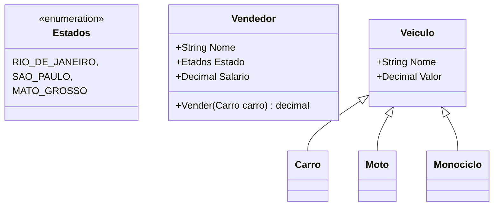
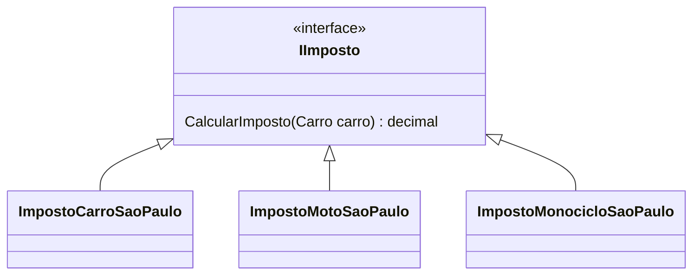
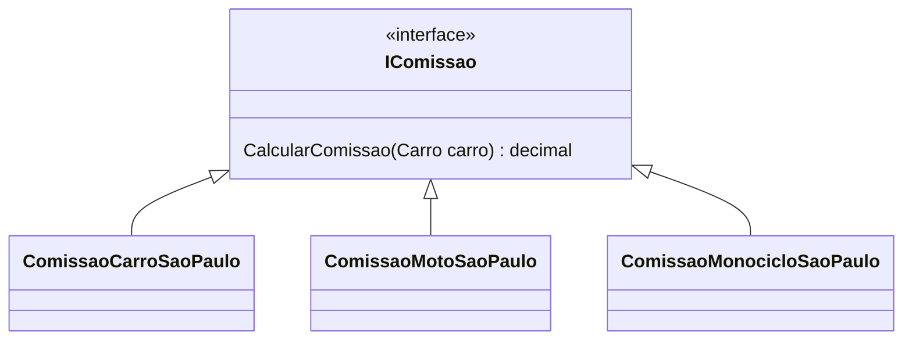
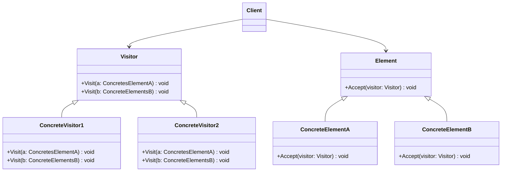
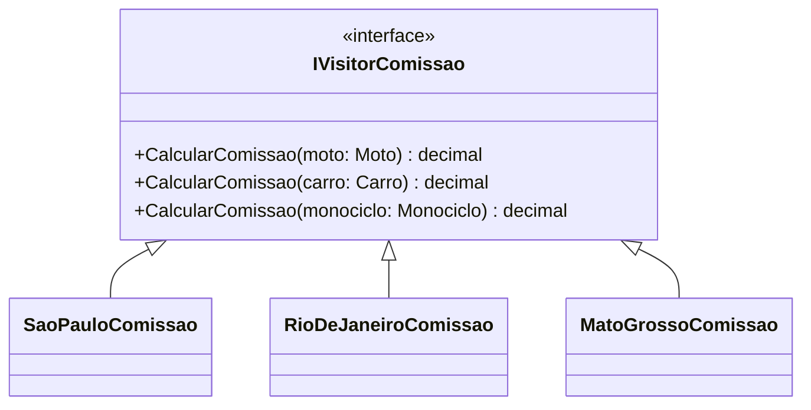

<body>
    <script src="https://cdn.jsdelivr.net/npm/mermaid/dist/mermaid.min.js"></script>
</body>

# Design Pattern Visitor

## Problema Proposto
O modelo de problema proposto é de uma loja de carros.

Pense que temos uma separação de alguns tipos de produtos (carros) e que cada um destes
tipos de produtos são separados em mais grupos, como esportivos, convencionais ou luxo. Esses tipos 
são separados assim pois nossa loja de carros vai atuar em 3 estados brasileiros distintos e cada um deles
cobra uma taxa especifica de imposto, outro ponto é que nossos vendedores tem comissões especificas em cada
estado.

## Reflexão
Preciso que você pense em formas de resolver esse problema respeitando os principios SOLID e com o melhor
pattern possivel. Antes vou apresentar as classes.



### Solução Ruim
Se você pensou em implementar varios _ifs_ na classe que define os impostos e comissão,
você pensou na pior solução hshshshs, mas relaxa estou aqui para passar um pouco 
do conhecimento que eu tenho para te ajudar a melhorar.

```csharp
class Vendedor{
    public string Nome {get; set;}
    public Estados Estado {get; set;}
    public decimal Salario {get; set;}
    
    public decimal Vender(Veiculo carro){
        decimal comissao = 0.0;
        decimal imposto = 0.0;
        
        if(Estado == Estados.SAO_PAULO){
            if(veiculo.GetType() == typeof(Carro)){
               // implementar comissão do Carro em São Paulo
            }
            else if(veiculo.GetType() == typeof(Moto)){
               // implementar comissão de Moto em São Paulo
            }
            else if(veiculo.GetType() == typeof(Monociclo)){
               // implementar comissão de Monociclo em São Paulo
            }
        }
        else if(Estado == Estados.RIO_DE_JANEIRO){
            if(veiculo.GetType() == typeof(Carro)){
               // implementar comissão do Carro no Rio de Janeiro
            }
            else if(veiculo.GetType() == typeof(Moto)){
               // implementar comissão de Moto no Rio de Janeiro
            }
            else if(veiculo.GetType() == typeof(Monociclo)){
               // implementar comissão de Monociclo no Rio de Janeiro
            }
        }
        else if(Estado == Estados.MATO_GROSSO){
            if(veiculo.GetType() == typeof(Carro)){
               // implementar comissão do Carro em Mato Grosso
            }
            else if(veiculo.GetType() == typeof(Moto)){
               // implementar comissão de Moto em Mato Grosso
            }
            else if(veiculo.GetType() == typeof(Monociclo)){
               // implementar comissão de Monociclo em Mato Grosso
            }
        }
        
        return Salario - comissao - imposto;
    }
}
```

### Solução Mediana
Utilizar o design pattern Strategy para criar estratégias de calculo de imposto e comissão para cada estado.
Ela é mediana pois podemos tirar aquela porrada de _ifs_ da solução anterior fazendo uma injeção de dependencia no método _Vender()_,
porém vamos criar muitas estratégias se quisermos fazer isso de maneira correta, pois perceba que cada estratégia tem 3 subestratégias,
ou seja, cada estado vai tratar de 3 categorias distintas de carros portando generalizanado teriamos n * m estratégias, um verdadeiro
caos quando o sistema crescer. Vou fazer o diagrama de UML e você vai ver a representação gráfica do que falei.







Perceba que cada estado brasileiro tem 3 implementações concretas para cada estratégia (__IImposto__ e __IComissao__) e cada vez que pensarmos em vender algo novo em uma localidade são duas implementações concretas que temos que fazer, a vantagem de usar esse pattern é que se quisermos vender algo somente em São Paulo podemos fazer somente mais 2 implementações sem quebrar as implementações do Rio de Janeiro e Mato Grosso, porém como eu disse é praticamente impraticavel utilizar esse pattern pela quantidade de implementações diferentes que vamos ter quando o sistema crescer.
Vou escrever um exemplo de como ficaria esse código porém vendendo só motos e carros nos estados do Rio de Janeiro e São Paulo.
#### Strategy
```csharp
public interface IImposto{
    decimal CalcularImposto(Carro carro);
}

public interface IComissao{
    decimal CalcularComissao(Carro carro);
}
```
#### Rio de Janeiro Implementação
```csharp
public class ImpostoMotoRioDeJaneiro : IImposto {
    public decimal CalcularImposto(Carro carro) => 0.12 * carro.Valor;
}

public class ComissaoMotoRioDeJaneiro : IComissao {
    public decimal CalcularComissao(Carro carro) => 0.08 * carro.Valor;
}

public class ImpostoCarroRioDeJaneiro : IImposto {
    public decimal CalcularImposto(Carro carro) => 0.15 * carro.Valor;
}

public class ComissaoCarroRioDeJaneiro : IComissao {
    public decimal CalcularComissao(Carro carro) => 0.05 * carro.Valor;
}
```

#### São Paulo Implementação
```csharp
public class ImpostoMotoSaoPaulo : IImposto {
    public decimal CalcularImposto(Carro carro) => 0.07 * carro.Valor;
}

public class ComissaoMotoSaoPaulo : IComissao {
    public decimal CalcularComissao(Carro carro) => 0.12 * carro.Valor;
}

public class ImpostoCarroSaoPaulo : IImposto {
    public decimal CalcularImposto(Carro carro) => 0.19 * carro.Valor;
}

public class ComissaoCarroSaoPaulo : IComissao {
    public decimal CalcularComissao(Carro carro) => 0.09 * carro.Valor;
}
```
#### Vendedor Implementação
```csharp
class Vendedor{
    public string Nome {get; set;}
    public Estados Estado {get; set;}
    public decimal Salario {get; set;}
    
    public decimal Vender(Veiculo carro, IImposto imposto, IComissao comissao){
        return Salario - comissao.CalcularComissao() + imposto.CalcularImposto();
    }
}
```
Repare que a implementação do método __Vender__ na classe __Vendedor__ ficou bem menor, entretanto aumentamos a complexidade na hora de chamar o método, perceba ainda que nada impede de passarmos uma implementação de imposto de São Paulo e um calculo de comissão do Rio De Janeiro, ou ainda um calculo de imposto para carro e um de comissão de moto, são erros que podemos cometer ao chamar o método, por isso a quantidade de implementações diferentes dessa solução é considerada um problema. Vamos dar uma olhada na proxima solução e ver como ela resolve esse problema de forma semelhante.
## Introdução ao Visitor
Vou apresentar primeiramente o diagrama UML do padrão, e relacionar com nosso problema.


Pessoal ja da pra ter ideia que o sistema ficou bem mais tranquilo de manter com essa mudança, olha que belezinha se quisermos adicionar mais um estado basta adicionar mais duas classes e implementar os métodos das interfaces __IVisitorComissao__ e __IVisitorImposto__, houve uma grande diminuição de implementações em relação ao pattern anterior (__Strategy__), mas nem tudo são flores repare que todo estado novo devera implementar os métodos de calculo de comissão e imposto para todos os tipos de veiculos mesmo que ele só venda motos por exemplo, isso deixa nossa solução com um certo ponto fraco. Se você esta esperto com o UML do pattern viu que temos que fazer uma pequena mudança nos nossos __ConcreteElements__, eles precisam de um método que receba nossas implementações de visitor.
Primeiramente vou mostrar a implementação para São Paulo dos nossos dois visitors, repare que nossos métodos __Visit ()__ ligados aos __Visitors__ do padrão serão os métodos __CalculaImposto ()__ e __CalculaComissao()__.
### Classe VisitorImpostoSaoPaulo
```csharp
public class VisitorImpostoSaoPaulo: IVisitorImposto{

  public decimal CalculaImposto(Carro carro){
      return carro.Preco * (decimal) 0.1;
  }

  public decimal CalculaImposto(Monociclo monociclo){
      return monociclo.Preco * (decimal) 0.08;
  }

  public decimal CalculaImposto(Moto moto){
      return moto.Preco * (decimal) 0.04;
  }
}
```
### Classe VisitorComissaoSaoPaulo
```csharp
public class VisitorComissaoSaoPaulo: IVisitorImposto{

  public decimal CalculaComissao(Carro carro){
      return carro.Preco * (decimal) 0.01;
  }

  public decimal CalculaComissao(Monociclo monociclo){
      return monociclo.Preco * (decimal) 0.01;
  }

  public decimal CalculaComissao(Moto moto){
      return moto.Preco * (decimal) 0.01;
  }
}
```
Pronto com nossos visitor concretos implementados podemos alterar nossos elementos concretos para serem visitados, nesse momento se atente que o método __Accept ()__ ligado aos __Elements__ do padrão serão nossos métodos __Comissao ()__ e __Imposto ()__.
### Classe Veiculo
```csharp
public abstract class Veiculo
{
  public decimal Preco { get; set; }

  public Veiculo(decimal   preco){
      Preco = preco;
  }
  public abstract decimal Comissao(IVisitorComissao comissao);
  public abstract decimal Imposto(IVisitorImposto visitor);
}

```
Abaixo temos as implementações para cada tipo especifico de __Veiculo__.
### Classe Carro
```csharp
public class Carro: Veiculo{
  public Carro(decimal preco):base(preco){}
    
  public override decimal Comissao(IVisitorComissao visitor){
      return visitor.CalculaComissao(this);
  }
    
  public override decimal Imposto(IVisitorImposto visitor){
      return visitor.CalculaImposto(this);
  }

}
```
### Classe Moto
```csharp
public class Moto: Veiculo{
  public Moto(decimal preco):base(preco){}
    
  public override decimal Comissao(IVisitorComissao visitor){
      return visitor.CalculaComissao(this);
  }
    
  public override decimal Imposto(IVisitorImposto visitor){
      return visitor.CalculaImposto(this);
  }
}
```
### Classe Monociclo
```csharp
public class Monociclo: Veiculo{
  public Monociclo(decimal preco):base(preco){}
    
  public override decimal Comissao(IVisitorComissao visitor){
      return visitor.CalculaComissao(this);
  }
    
  public override decimal Imposto(IVisitorImposto visitor){
      return visitor.CalculaImposto(this);
  }
}
```
### Classe Vendedor
```csharp
public class Vendedor
{
    public static decimal Vender(
        Veiculo veiculo, 
        IVisitorComissao calculadoraComissao,
        IVisitorImposto calculadoraImposto
  )
  {
      decimal comissao = veiculo.Comissao(calculadoraComissao);

      decimal imposto = veiculo.Imposto(calculadoraImposto);

      return veiculo.Preco + imposto - comissao;
  }
}
```
Agora que nosso código esta pronto veja como é facil utliza-lo.
### Utilizando o código 
```csharp
class Program
{
  public static void Main()
  {

      Func<dynamic, string> getName = variable => variable.GetType().Name;

      Veiculo carro = new Carro((decimal) 100_000);

      Veiculo moto = new Moto((decimal) 30_000);

      Veiculo monociclo = new Monociclo((decimal) 1_000);

      IVisitorImposto imposto = new VisitorImpostoSaoPaulo();

      IVisitorComissao comissao = new VisitorComissaoSaoPaulo();

      Veiculo[] veiculos = {carro, moto, monociclo};

      foreach (dynamic veiculo in veiculos){   
          Console.WriteLine($"Valor do {getName(veiculo)}: {veiculo.Preco}");
          Console.WriteLine($"Valor de Venda {getName(veiculo)}: {Vendedor.Vender(veiculo,     comissao, imposto)}\\n");
      }
  }
}
```
### Output
```powershell
Valor do Carro: 100000
Valor de Venda Carro: 109000,00

Valor do Moto: 30000
Valor de Venda Moto: 30900,00

Valor do Monociclo: 1000
Valor de Venda Monociclo: 1070,00
```
Veja como é facil utlizar outros __visitors__ basta implementar um visitor para o Rio de Janeiro ou para qualquer outro estado e utiliza-lo, se você quiser treinar a implementação crie suas implementações para outros estados, troque a instancia no arquivo Program.cs e veja seu o output esta de acordo com suas implementações.
Espero que você tenha gostado, caso tenha alguma duvida estarei postando um video seguindo esse roteiro e implementando do zero.
Link: …
Até Mais
